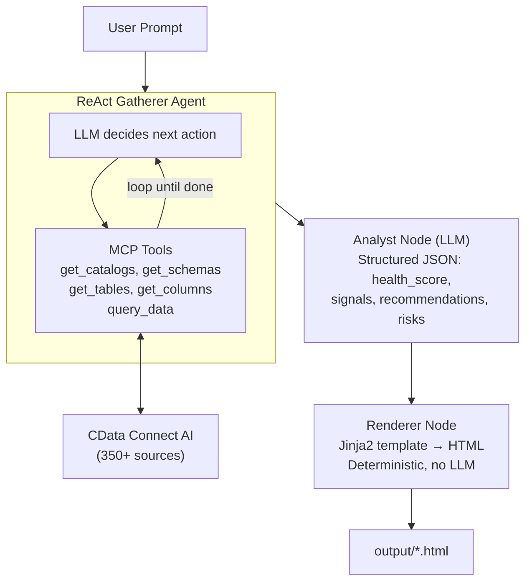

# LangGraph Customer Health Agent

[](https://www.python.org/downloads/)
[](LICENSE)
[](https://langchain-ai.github.io/langgraph/)
[](https://www.cdata.com/ai/)

Build intelligent customer health analysis agents that autonomously discover data schemas, query live enterprise data, and generate executive health briefs using **LangGraph** + **CData Connect AI**.

> **NOTE:** While this guide uses Google Sheets as the data source, the same principles apply to any of the [350+ data sources](https://www.cdata.com/ai/) CData Connect AI supports.

## Architecture



**How it works:**
1. A **ReAct Gatherer Agent** autonomously discovers schemas via MCP tools and gathers data through iterative tool calls
2. An **Analyst node** makes a single LLM call to produce a structured JSON health assessment (score, signals, recommendations, risks)
3. A **Renderer node** fills a Jinja2 template with the analysis and saves a styled HTML brief (deterministic, no LLM)
4. **Schema caching** avoids redundant discovery on subsequent runs (24h TTL by default)
5. Each node can be upgraded to a full agent by adding tools -- the pipeline is **multi-agent-ready**

## Agent Pipeline Patterns

The gatherer uses LangGraph's `create_react_agent` -- a ReAct (Reason + Act) loop where the LLM decides which tool to call next based on results so far. This means the agent:

- Discovers schemas dynamically (no hard-coded table names)
- Adapts queries based on what it finds
- Handles any CData-connected data source without code changes

The Analyst is a single structured LLM call (no tools), and the Renderer is fully deterministic (no LLM). Both are designed as extension points -- add tools to either node and it becomes a full agent. This separation keeps the pipeline predictable while giving the gatherer maximum flexibility.

## Quick Start

### Prerequisites

- **Python 3.8+** ([Download](https://www.python.org/downloads/))
- **CData Connect AI account** ([Free trial](https://www.cdata.com/ai/signup/))
- **OpenAI API key** ([Get key](https://platform.openai.com/api-keys)) or another supported LLM provider
- **Git** ([Download](https://git-scm.com/))

### Installation

```bash
git clone https://github.com/CDataSoftware/langgraph-customer-health-agent.git
cd langgraph-customer-health-agent
pip install -r requirements.txt
cp .env.example .env
# Edit .env with your credentials
```

### Set Up Sample Data

1. Copy the [sample Google Sheet](https://docs.google.com/spreadsheets/d/1JpzuvwOlGp0FKDBxNgj6XgTDL2awuiZ3Ycs4_SnjJT8/edit?usp=sharing) (**File > Make a copy**, name it "demo_organization")
2. In [CData Connect AI](https://cloud.cdata.com/), add a Google Sheets connection pointing to the copied sheet
3. Create a Personal Access Token under Settings > Access Tokens
4. Update `.env` with your credentials

## Quick Run (Interactive)

The easiest way to get started. The interactive runner handles setup, credential configuration, and running the agent:

```bash
python run.py
```

It provides a menu-driven interface to:
1. **Setup wizard** -- configure CData credentials and choose an LLM provider (OpenAI, Gemini, DeepSeek)
2. **Run health analysis** -- analyze a specific account with sample suggestions
3. **Run open-ended query** -- ask any question about your data
4. **Refresh schema cache** -- clear cached schemas for re-discovery
5. **Check setup** -- verify credentials, test MCP connection, check dependencies

> `rich` is auto-installed on first run if not already present.

## CLI Usage (Direct)

### Account Health Analysis

```bash
python src/main.py --account "Premium Auto Group Europe"
```

Runs the full 3-node pipeline: discover schema, gather data, analyze health, render HTML brief.

### Open-Ended Query

```bash
python src/main.py "Which industries have the highest average revenue?"
python src/main.py "Show me all accounts with high priority open tickets"
```

Ask any question -- the ReAct agent figures out which tables and queries to run.

### Options

```bash
python src/main.py --account "Acme Corp" --verbose        # DEBUG logging
python src/main.py --account "Acme Corp" --refresh-schema # Force schema re-discovery
```

| Flag | Description |
|------|-------------|
| `--account NAME` | Shortcut for health analysis of a specific account |
| `--refresh-schema` | Clear cached schema and re-discover on next run |
| `--verbose` | Set log level to DEBUG for detailed output |

## Multi-Provider LLM Support

Configure the LLM provider via environment variables:

| Provider | `LLM_PROVIDER` | `LLM_MODEL` (example) | Required package |
|----------|----------------|----------------------|-----------------|
| OpenAI | `openai` | `gpt-4o` | `langchain-openai` (included) |
| Anthropic | `anthropic` | `claude-sonnet-4-20250514` | `langchain-anthropic` |
| Google | `google` | `gemini-pro` | `langchain-google-genai` |
| Ollama | `ollama` | `llama3` | `langchain-ollama` |

Any OpenAI-compatible API (DeepSeek, Azure OpenAI, etc.) works with `LLM_PROVIDER=openai` and `OPENAI_API_BASE`.

## Schema Caching

On first run, the agent discovers schemas via MCP (catalogs, tables, columns). This metadata is cached to `~/.cache/langgraph-health/schema.json` with a 24-hour TTL.

- **Cache hit:** Agent skips discovery and starts querying immediately
- **Cache miss/expired:** Agent discovers schema, then caches for next run
- **Force refresh:** `--refresh-schema` flag or set `SCHEMA_CACHE_TTL=0`
- **Demo shortcut:** Set `CDATA_CATALOG` in `.env` to skip catalog discovery

## Extending the Agent Pipeline

Add custom agents by appending to the `PIPELINE` list in `src/graph.py`:

```python
PIPELINE = [
    ("gather", gather_node),
    ("analyze", analyze_node),
    ("my_custom_step", my_custom_node),  # Add your agent here
    ("render", render_node),
]
```

Each node receives and returns the shared `AgentState` dict.

## Project Structure

```
langgraph-customer-health-agent/
├── run.py                     # Interactive runner (python run.py)
├── src/
│   ├── config.py              # Configuration & get_llm() factory
│   ├── state.py               # AgentState TypedDict
│   ├── mcp_tools.py           # 5 @tool-decorated MCP wrappers
│   ├── schema_cache.py        # TTL-based schema cache
│   ├── logger.py              # Lightweight logging & stats
│   ├── graph.py               # 3-node LangGraph pipeline
│   ├── main.py                # CLI entry point
│   ├── agents/
│   │   ├── __init__.py
│   │   ├── gatherer.py        # ReAct agent (schema discovery + queries)
│   │   ├── analyst.py         # LLM node: structured JSON health analysis
│   │   └── renderer.py        # Deterministic node: Jinja2 HTML brief renderer
│   └── templates/
│       └── brief.html         # Jinja2 HTML template
├── output/                    # Generated briefs
├── requirements.txt
├── .env.example
├── .gitignore
└── README.md
```

## Environment Variables

```ini
# Required
CDATA_EMAIL=your-email@company.com
CDATA_PAT=your-personal-access-token
OPENAI_API_KEY=sk-proj-...

# LLM configuration
LLM_PROVIDER=openai                 # openai, anthropic, google, ollama
LLM_MODEL=gpt-4o                    # Model name for chosen provider

# Optional
CDATA_CATALOG=ConnectionName         # Skip catalog discovery
SCHEMA_CACHE_TTL=86400               # Cache TTL in seconds (default 24h)
LOG_LEVEL=INFO                       # INFO or DEBUG
MAX_ITERATIONS=15                    # Max ReAct tool-call loops
OPENAI_API_BASE=https://...          # Custom API base URL
```

## Troubleshooting

| Error | Solution |
|-------|----------|
| `Query returned no results` | Verify connection name and data existence in CData Connect AI |
| `MCP error` | Check CDATA_EMAIL / CDATA_PAT in .env |
| `Unsupported LLM_PROVIDER` | Use openai, anthropic, google, or ollama |
| `ImportError: langchain-...` | Install the package for your chosen LLM provider |
| Agent loops too many times | Reduce MAX_ITERATIONS or set CDATA_CATALOG to narrow scope |

## Resources

- [LangGraph Documentation](https://langchain-ai.github.io/langgraph/)
- [CData Connect AI](https://www.cdata.com/ai/)
- [OpenAI API Documentation](https://platform.openai.com/docs)
- [Model Context Protocol](https://modelcontextprotocol.io/)
- [CData Community Forums](https://community.cdata.com/)

---

## License

MIT License - See [LICENSE](LICENSE) for details.

**CData Software** - [https://www.cdata.com](https://www.cdata.com)
