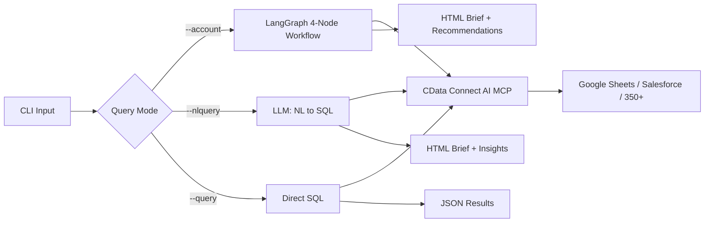
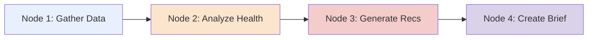

# LangGraph Customer Health Agent

[](https://www.python.org/downloads/)
[](LICENSE)
[](https://langchain-ai.github.io/langgraph/)
[](https://www.cdata.com/ai/)

Build intelligent customer health analysis applications that query live enterprise data, analyze account health, and generate executive briefs using **LangGraph** + **CData Connect AI**.

> **NOTE:** While this guide uses Google Sheets as the data source, the same principles apply to any of the [350+ data sources](https://www.cdata.com/ai/) CData Connect AI supports.

## What You Can Do

- Connect to 350+ enterprise data sources through CData Connect AI
- Analyze customer health using a 4-node LangGraph workflow
- Ask questions in plain English and get instant SQL + insights
- Generate beautiful HTML briefs with embedded styling
- Switch between data sources (Google Sheets / Salesforce) with zero code changes

## Architecture



**How it Works:**
1. Python app connects to CData Connect AI via MCP (HTTP Basic Auth)
2. MCP server exposes data discovery and query tools
3. LangGraph manages workflow state across four analysis nodes
4. OpenAI-compatible LLM generates SQL from natural language and creates recommendations
5. Professional HTML briefs are generated with embedded CSS

## Three Query Modes

### 1. Account Health Analysis
```bash
python src/main.py --account "Premium Auto Group Europe"
```
Runs a 4-node workflow: Gather Data -> Analyze Health -> Generate Recommendations -> Create Brief

**Output:** HTML brief with health score (Green/Yellow/Red), metrics, and AI recommendations

### 2. Natural Language Query
```bash
python src/main.py --nlquery "Show me the top 10 customers by revenue"
python src/main.py --nlquery "All customers in the energy sector"
python src/main.py --nlquery "How many open opportunities and total pipeline value?"
```

**Output:** HTML brief with query info, results table, and AI business insights

### 3. Direct SQL Query
```bash
python src/main.py --query "SELECT TOP 10 [Name], [AnnualRevenue] FROM [Connection].[GoogleSheets].[demo_organization_account] ORDER BY [AnnualRevenue] DESC"
```

**Output:** Formatted table + JSON results

---

## Quick Start

### Prerequisites

- **Python 3.8+** ([Download](https://www.python.org/downloads/))
- **CData Connect AI account** ([Free trial](https://www.cdata.com/ai/signup/))
- **OpenAI API key** ([Get key](https://platform.openai.com/api-keys)) or any OpenAI-compatible LLM API
- **Git** ([Download](https://git-scm.com/))

### Installation

```bash
git clone https://github.com/CDataSoftware/langgraph-customer-health-agent.git
cd langgraph-customer-health-agent
pip install -r requirements.txt
cp .env.example .env
# Edit .env with your credentials
python src/main.py --nlquery "Show me the top 5 customers by revenue"
```

### Environment Variables

```ini
# OpenAI Configuration (or any OpenAI-compatible LLM)
OPENAI_API_KEY=sk-proj-...
OPENAI_API_URL=https://api.openai.com/v1/chat/completions
OPENAI_MODEL=gpt-4o

# CData Connect AI Configuration
CDATA_EMAIL=your-email@company.com
CDATA_PAT=your-personal-access-token-here

# Data Source (google_sheets or salesforce)
DATA_SOURCE=google_sheets
GOOGLE_SHEETS_CONNECTION=LangGraph_Customer_Health_Agent_Google_Sheet
SALESFORCE_CONNECTION=LangGraph_Customer_Health_Agent
```

### Set Up Sample Data

1. Copy the [sample Google Sheet](https://docs.google.com/spreadsheets/d/1JpzuvwOlGp0FKDBxNgj6XgTDL2awuiZ3Ycs4_SnjJT8/edit?usp=sharing) (**File > Make a copy**, name it "demo_organization")
2. In [CData Connect AI](https://cloud.cdata.com/), add a Google Sheets connection pointing to the copied sheet
3. Create a Personal Access Token under Settings > Access Tokens
4. Update `.env` with credentials

---

## LangGraph Workflow



| Node | Purpose |
|------|---------|
| **Gather Data** | Queries account details, opportunities, and support cases via MCP |
| **Analyze Health** | Calculates health score (Green/Yellow/Red) from case volume and priority |
| **Generate Recommendations** | LLM creates 5 actionable strategies based on health signals |
| **Create Brief** | Generates professional HTML brief with embedded CSS |

### Health Score Logic

| Score | Criteria |
|-------|----------|
| **Green** | Healthy account, low case volume, active engagement |
| **Yellow** | Warning signs: high-priority cases or declining engagement |
| **Red** | At-risk: >3 high-priority cases or >10 open cases |

---

## Project Structure

```
langgraph-customer-health-agent/
├── src/
│   ├── config.py                    # Configuration & credentials
│   ├── mcp_client_production.py     # CData MCP protocol client
│   ├── tools.py                     # Data source query tools
│   ├── langgraph_agent.py           # 4-node LangGraph workflow
│   ├── nl_query.py                  # Natural language -> SQL
│   └── main.py                      # CLI entry point (3 modes)
├── output/                           # Generated briefs & results
├── requirements.txt
├── .env.example
├── .gitignore
└── README.md
```

---

## Switching Data Sources

```bash
# Google Sheets (demo):
DATA_SOURCE=google_sheets

# Salesforce (production):
DATA_SOURCE=salesforce
```

No code changes needed. The agent dynamically resolves connection names and table names.

---

## Troubleshooting

| Error | Solution |
|-------|----------|
| `Query returned no results` | Verify connection name, table names, and data existence |
| `Failed to initialize MCP` | Check CDATA_EMAIL / CDATA_PAT in .env |
| `Method not found` | Ensure connection is saved in CData Cloud with exact name |
| `OpenAI API error` | Verify API key and check remaining credits |

---

## Resources

- [LangGraph Documentation](https://langchain-ai.github.io/langgraph/)
- [CData Connect AI](https://www.cdata.com/ai/)
- [OpenAI API Documentation](https://platform.openai.com/docs)
- [Model Context Protocol](https://modelcontextprotocol.io/)
- [CData Community Forums](https://community.cdata.com/)

---

## License

MIT License - See [LICENSE](LICENSE) for details.

**CData Software** - [https://www.cdata.com](https://www.cdata.com)
